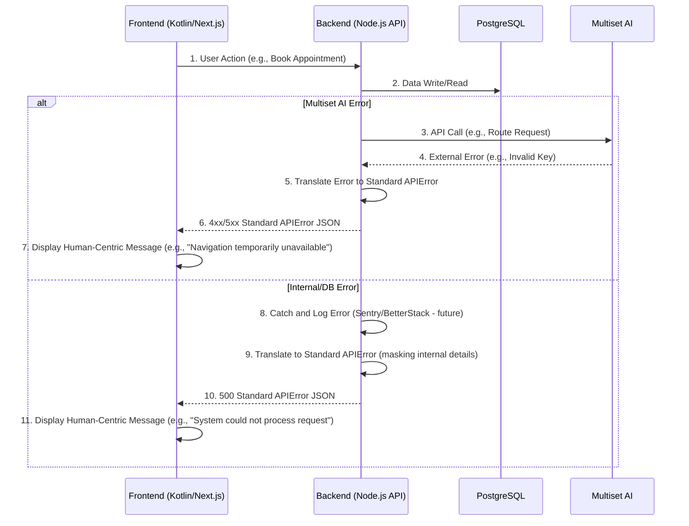

# Waylio Product Requirements Document (PRD)

## Context

- **Waylio** is a hyper-accurate, AR-based indoor navigation and comprehensive campus management platform. It addresses the chronic confusion and inefficiency in large healthcare facilities by guiding users seamlessly through their entire visit, from smart parking, appointment booking, queue management and digital prescriptions to finding specific points of interest. This solution will revolutionize the patient and visitor experience by integrating core services into a single, user-friendly application. The primary target market is large hospital campuses and healthcare providers.

## Problem Statement

The core problem to be solved by the **Waylio MVP** is the systemic inefficiency and high stress experienced during the **end-to-end healthcare journey** within large campuses. This is now rooted in **four interconnected pain points**:

1. **Appointment & Clinical Bottlenecks:** Manual or disconnected appointment processes lead to excessive waiting for patients, compounded by **inefficient paper-based or disconnected clinical workflows** for doctors, who lack real-time visibility into their patient queues and rely on slow, traditional prescription methods.  
2. **Prescription Inefficiency:** The process of creating, handing off, and tracking prescriptions is non-digital, leading to errors, delays in fulfillment (e.g., at the pharmacy), and a lost opportunity for streamlined **patient-facing digital prescription management**.  
3. **Confusion & Delay in Navigation:** Inadequate indoor guidance and complex layouts cause visitors and staff to waste time and experience high anxiety attempting to find specific destinations.  
4. **Parking Friction:** Inefficient parking systems result in **gate congestion and wasted time searching for slots**, creating a stressful first and last impression of the campus visit.

Current solutions fail because they lack the **hyper-accurate indoor AR navigation** and the **seamless, unified platform** required to integrate these four critical service pillars into a unified, efficient, low-stress, end-to-end digital experience for both visitors and staff.

## FEATURES & ROLES

### System-Wide Logic & Technology

This plan will be implemented using the components specified in the `overview.md` template:

* **Authentication & User Management:** All user profiles, roles (Admin, Doctor, etc.), and organization assignments will be managed by **Clerk**. This directly handles your requirement for users to be auto-linked to an organization on signup.
* **Dashboards (Web):** All non-patient web interfaces (for Admin, Doctor, Reception) will be served from the **`apps/app`** Next.js application.
* **Patient App (Mobile):** The **`Public User (Patient)`** app remains the native Kotlin/Swift mobile app specified in the PRD.
* **Database:** All data (org structures, appointments, prescriptions, users) will be stored in the **Neon** (PostgreSQL) database and accessed via the **Prisma** ORM.
* **Backend & API:** The mobile app and web dashboards will communicate with the backend via the serverless functions defined in the **`apps/api`** directory.
* **Real-Time Updates:** "LIVE" queue and status updates will be powered by **Knock**. Backend events (like "check-in" or "appointment complete") will trigger **Knock workflows**, which push in-app notifications to patients, doctors, and reception staff.

---

### 1. ADMIN (Super Admin)

This role has full system oversight, using the "Admin (Super Admin)" dashboard within `apps/app`.

* **Organization Management:**
    * Creates and manages the Healthcare Organisation profile within **Clerk**.
    * Accesses a dedicated page in `apps/app` to define the `HOSPITAL_STRUCTURE` (e.g., Clinical, Ancillary departments), saving this data via **Prisma**.
* **User Management:**
    * Performs **Staff/Doctor CRUD Management** by inviting, deleting, and assigning roles (Doctor, Reception, etc.) to users within the **Clerk** organization.
* **Monitoring & Operations:**
    * Views the **LIVE Occupancy Dashboard** (for parking and departments) and **Operations & Metrics Dashboard** for org-wide reports.
    * Manages the **Complaints / Feedback Resolution Mechanism**.
* **AR Navigation:**
    * Can raise a request (via the dashboard) to developers to update the AR campus map.

---

### 2. DOCTOR (Organisation User)

This role uses the "Doctor - Web Dashboard" within `apps/app` to manage their clinical workflow.

* **Profile & Schedule:**
    * Manages their own profile, including consultation fees, availability, and holidays, as defined in the "Doctor Profile Management" screen.
* **Appointment & Queue Management:**
    * Views the **Daily Appointments Dashboard** in a "Kanban/Calendar View" to see their patient list.
    * Interacts with the **LIVE Patient Card Feed**. Marking a patient as "Viewed" or "Complete" triggers a backend event.
    * This event triggers a **Knock workflow** to auto-increment the queue, notifying the next patient (FR3) and updating the Reception dashboard in real-time.
* **Clinical Workflow:**
    * Views the patient's medical history and appointment details from the patient card.
    * Generates digital prescriptions using the **Digital Prescription Creation Form/Editor** (FR5).
    * Submitting the prescription saves it to the **Prisma** database, triggers a **Knock** notification to the patient (FR6), and may use **Resend** to send a copy via email.

---

### 3. RECEPTION (Organisation User)

This role uses the "Reception Staff - Web Dashboard" within `apps/app` to manage patient intake.

* **Patient Intake:**
    * Uses the **Manual Appointment Creation Flow** to register non-technical or walk-in users.
* **Monitoring:**
    * Views the **Doctor Booking Details View** to monitor all organisation-wide medical activities.
    * Receives real-time queue updates (powered by **Knock**) to see the LIVE status of all doctor queues.

---

### 4. NURSING (Organisation User)

This role is defined in the hospital structure and will be managed in **Clerk**.

* **Permissions:** As you specified, this role will be assigned the same permissions and dashboard access as the **RECEPTION** role.

---

### 5. PARKING-SECURITY (Organisation User)

This is a limited-access role. The PRD specifies that live occupancy monitoring is an **ADMIN** feature.

* **Vehicle Validation:**
    * This user's primary function is to **visually validate** the **Digital Parking Ticket/Session View** on the Patient's mobile app at entry/exit points.
* **Live View (If Built):**
    * Your request for a dedicated "LIVE viewing" dashboard for this role would be a new, simplified view in `apps/app` that reads parking slot status from the **Prisma** database.

---

### 6. PUBLIC USERS (Patients)

This role uses the native **Kotlin (Android)** / **Swift (iOS)** mobile app.

* **Authentication:**
    * Logs into the mobile app using the same **Clerk** authentication service.
* **Appointment & Queue Management (P1):**
    * Performs CRUD operations for their appointments (FR1) and uses **Digital E-Check-in** (FR2).
    * Views their **LIVE QUEUE** position (FR3) via the **Knock** in-app notification feed.
* **Parking (P4):**
    * Manages their parking session: scans QR, makes an **upfront fixed-time payment** (FR10), and receives a **Digital Parking Ticket** (FR11).
* **Prescriptions (P2):**
    * Views and stores their **Digital Prescriptions** (FR6) immediately after the doctor generates them.
* **Navigation (P3):**
    * Uses the **AR-Based Indoor Pathfinding** (FR7) and **POI Search** (FR9) to navigate to their appointment or parking spot (FR10).

## Background Context

The healthcare campus experience is plagued by inefficiency and high stress, primarily driven by disjointed systems for navigation, appointments, and clinical handoffs6. The **Waylio MVP** addresses this by unifying the visitor and staff experience across four critical, high-priority areas: Appointment Booking, Digital Prescriptions, AR Navigation, and lean Smart Parking7. Success hinges on delivering a hyper-accurate, low-latency mobile and web platform that adheres to strict budget and velocity constraints while ensuring data integrity8.

### Features

The **Waylio MVP** will deliver a highly integrated digital platform focused on four core areas to eliminate campus friction:

1. **Smart Appointment & Queue Management:** Streamline patient flow with **pre-registration, digital e-check-in, and virtual queuing**. This includes a **Doctor Dashboard** that shows real-time patient queue status, allowing for efficient patient flow management.  
     
2. **Digital Prescription Management:** Directly integrate with the clinical workflow by allowing doctors to **create and generate electronic prescriptions** within their dashboard. This enables the patient (via the app) to receive the digital prescription instantly and allows for streamlined fulfillment at the on-campus pharmacy.  
     
3. **AR-Based Indoor Pathfinding:** Utilize **Multiset AI** to provide seamless, turn-by-turn guidance, which enables hyper-accurate location technology (1-meter precision) that requires no new hardware. The intuitive interface uses **AR Mode** (device held up) and **2D Map Mode** (device held down) for guidance.  
     
4. **Smart Parking Management:** Implement a **QR-based smart parking system** focusing only on **upfront fixed-time payment, slot assignment, and turn-by-turn navigation** directly to the spot.

## Requirements

### Functional

1. **FR1: Appointment Scheduling:** The system shall allow a user (Patient/Attendant) to browse available departments/doctors, select a time slot, and successfully process an initial fee/co-pay using an integrated payment gateway9.  
     
2. **FR2: Digital E-Check-in:** The system shall allow the user to digitally check in for their appointment upon arrival at the hospital campus via the mobile app10.  
     
3. **FR3: Queue Status Visibility (Patient):** The system shall display the user's current position in the virtual queue and notify them via push notification when it is time to proceed to their appointment location (e.g., when 2 spots away)11.  
     
4. **FR4: Doctor Queue Dashboard:** The system shall provide a dedicated web dashboard for the Doctor to view their real-time, sequential list of arriving patients for the day, including patient details and check-in status12.  
     
5. **FR5: Digital Prescription Creation:** The system shall enable the Doctor, via the web dashboard, to create a new prescription, search for medicines (from an integrated database), specify dosage, and electronically sign/transmit the final prescription to the patient's app and the on-campus pharmacy system13.  
     
6. **FR6: Digital Prescription Access (Patient):** The patient shall be able to view and store their digital prescription within the mobile app immediately after the doctor transmits it14.  
     
7. **FR7: AR-Based Navigation Core:** The system shall utilize **Multiset AI** to provide highly stable, turn-by-turn indoor pathfinding with a guaranteed 1-meter accuracy across multi-level and multi-building campus environments15.  
     
8. **FR8: Dual Navigation Mode:** The mobile app shall present two distinct navigation modes: **AR Mode** (when the device is held up) and **2D Map Mode** (when the device is held down)16.  
     
9. **FR9: POI Search & Routing:** The system shall allow users to search for specific Points of Interest (POI) such as restrooms, cafeteria, or pharmacy, and receive turn-by-turn guidance to the nearest result17.  
     
10. **FR10: Lean Smart Parking Flow:** The system shall initiate a QR-code scanning process at the entry gate, process an **upfront fixed-time payment**, automatically assign an available parking slot ID, and provide turn-by-turn navigation to that spot18.  
      
11. **FR11: Parking Digital Ticket:** The system shall generate and display a unique digital parking ticket/session ID on the user's smartphone immediately after successful payment19.

### Non Functional

2. **NFR1: Data Integrity & Reliability:** The backend and database layers shall use **PostgreSQL** to ensure relational data integrity for all patient, appointment, and digital prescription records21.  
     
3. **NFR2: Cost Optimization:** All hosting and infrastructure decisions shall adhere strictly to a **Pay-as-You-Go budget model**, minimizing extravagant upfront costs and favoring scalable services (**Render**)22.  
     
4. **NFR3: Performance (Navigation):** The AR-based navigation experience must exhibit low-latency (near real-time) response to user movement to maintain the functional integrity of the 1-meter accuracy23.  
     
5. **NFR4: API Security:** All data transfer, especially involving health records and payment information, shall be secured using industry-standard encryption and adhere to strict role-based access controls for Staff and Doctor dashboards24.  
     
6. **NFR5: Code Velocity:** To meet the aggressive project timeline, the architecture must support a **minimum development and testing rate of 1 feature per week** (equivalent to frequent, small-scale story implementation)25.

## User Interface Design Goals

#### Overall UX Vision

The user experience vision is to provide **Clarity and Confidence** throughout a potentially stressful visit. The design must be **seamless and stress-reducing**, utilizing the AR navigation and integrated queue management to replace confusion and waiting with simple, intuitive digital guidance. The Doctor/Staff dashboards must prioritize **information efficiency and low-friction workflow**.

#### Design Principles

- **Clarity over cleverness** - Prioritize clear communication over aesthetic innovation.  
    
- **Emotional Reassurance & Transparency (NEW):** Use calming aesthetics and prioritize clear, human-centric messaging (e.g., time estimates, next steps) over complex jargon or blunt numbers (e.g., queue numbers) to actively reduce visitor anxiety.  
    
- **Seamless & Stress-Reducing:** The design must utilize the integrated systems to replace confusion and waiting with simple, intuitive digital guidance.  
    
- **AR/Map Toggle:** The core navigation interaction must be the **smooth, intuitive toggle** between AR Mode and 2D Map Mode.  
    
- **Zero-Friction Handoff (NEW):** Explicitly design the transition points (e.g., Parking to Indoor Navigation, Doctor to Pharmacy) to minimize cognitive load and prompt the user seamlessly to the next step.  
    
- **Progressive Disclosure:** Show only what's needed, when it's needed (e.g., detailed queue numbers revealed as the patient approaches the clinic).  
    
- **Accessible by Default (WCAG AA):** Design for all users, with the **2D Map View** serving as the fully accessible, primary fallback for navigation.  
    
- **Unified Flow:** The app must feel like a single workflow—the transition from the appointment booking confirmation to the parking module and then to the indoor navigation should be seamless.

---

## HOSPITAL STRUCTURE

```json
{
  "HOSPITAL_ORGANISATION": {
    "ADMIN": {
        "SERVICES": {
          "MEDICAL": {
            "CLINICAL": {
              "DEPARTMENTS": [
                "ORTHOPEDICS",
                "CARDIOLOGY",
                "NEUROLOGY",
                "OPHTHALMOLOGY",
                "DERMATOLOGY",
                "GYNAECOLOGY",
                "UROLOGY",
                "PULMONOLOGY",
                "GASTROENTEROLOGY",
                "HEPATOLOGY",
                "RHEUMATOLOGY",
                "ENDOCRINOLOGY",
                "DIABETES",
                "HEMATOLOGY",
                "ONCOLOGY",
                "RADIOLOGY"
              ]
            },
            "ANCILLARY": {
              "DEPARTMENTS": [
                "PHARMACY",
                "DIAGNOSTICS",
                "LABORATORY",
                "BLOOD BANK"
              ]
            }
          },
          "NURSING": {
            "DEPARTMENTS": [
              "CLINICAL MANAGEMENT",
              "SPECIALIZED HEALTHCARE",
              "STERILIZATION"
            ]
          },
          "OPERATIONS & SUPPORT": {
            "DEPARTMENTS": [
              "HUMAN RESOURCES",
              "PROCUREMENT",
              "ENGINEERING & FACILITIES MANAGEMENT",
              "SECURITY",
              "GENERAL SERVICES"
            ]
          },
          "FINANCE": {
            "DEPARTMENTS": [
              "ACCOUNTING"
            ]
          }
        }
    }
  }
}
```

## ESSENTIAL SCREENS

### 1\. PUBLIC USER (Patient/Attendant)

**Platform:** Mobile App (Kotlin/Swift)

| Feature Pillar | Core Screens & User Flow (Nested Hierarchy) | Description|
| :--- | :--- | :--- |
| **System & Auth** | \<ul\>\<li\>**Splash Screen**\</li\>\<li\>**Sign Up / Sign In Screen** (Utilizes Clerk UI)\</li\>\<li\>**Profile Management Screen**\<ul\>\<li\>Form: Edit Personal Details\</li\>\<li\>View: Past Visit History\</li\>\<li\>View: Past Payments\</li\>\</ul\>\</li\>\<li\>**Notifications Feed**\<ul\>\<li\>View: List of all system notifications (Powered by Knock)\</li\>\<li\>Item: "Your turn is next" (FR3)\</li\>\<li\>Item: "Your prescription is ready" (FR6)\</li\>\</ul\>\</li\>\</ul\> | Manages user session, profile, and real-time alerts. |
| **P4. Parking (Lean)** | \<ul\>\<li\>**Parking Flow (Initiated on arrival)**\<ul\>\<li\>Screen: **QR Scan & Upfront Payment Interface** (FR10)\</li\>\<li\>Screen: **Parking Lot Navigation View** (Triggers P3) (FR10)\</li\>\<li\>Screen: **Digital Parking Ticket/Session View** (FR11)\</li\>\</ul\>\</li\>\</ul\> | Handles the "first mile" of the visit from gate to spot. |
| **P1. Appointment** | \<ul\>\<li\>**Home Dashboard** (Shows upcoming appointment & parking status)\</li\>\<li\>**Appointment Booking Flow** (FR1)\<ul\>\<li\>Screen: Search Departments/Doctors\</li\>\<li\>Screen: Select Doctor (View Profile, Fees, Bio)\</li\>\<li\>Screen: Select Date & Time Slot\</li\>\<li\>Screen: Pre-registration Form\</li\>\<li\>Screen: Payment Gateway (Co-pay)\</li\>\<li\>Screen: Appointment Confirmation (CRUD own appointments)\</li\>\</ul\>\</li\>\<li\>**Appointment Detail Screen** (Active Visit)\<ul\>\<li\>Action: **Digital E-Check-in** (FR2)\</li\>\<li\>View: **LIVE Queue Status** (FR3)\</li\>\<li\>Action: "Navigate to Appointment" (Triggers P3)\</li\>\</ul\>\</li\>\</ul\> | The core flow for scheduling and managing a visit. |
| **P3. AR Navigation** | \<ul\>\<li\>**POI Search & Routing** (FR9)\<ul\>\<li\>Screen: Search Bar (Cafeteria, Pharmacy, Restrooms)\</li\>\<li\>Screen: Search Results List\</li\>\</ul\>\</li\>\<li\>**Live AR/Map Navigation Screen** (FR7)\<ul\>\<li\>Mode: **AR Mode** (Device held up) (FR8)\</li\>\<li\>Mode: **2D Map Mode** (Device held down) (FR8)\</li\>\</ul\>\</li\>\</ul\> | Provides seamless turn-by-turn guidance. |
| **P2. Prescription** | \<ul\>\<li\>**Prescription History List**\</li\>\<li\>**Digital Prescription Display Screen** (FR6)\<ul\>\<li\>View: Medicine, Dosage, Doctor's Signature (FR5)\</li\>\</ul\>\</li\>\</ul\> | Allows immediate access to post-consultation prescriptions. |

-----

### 2\. DOCTOR

**Platform:** Web Dashboard (`apps/app`)

| Feature Pillar | Core Screens & User Flow (Nested Hierarchy) | Description|
| :--- | :--- | :--- |
| **System & Auth** | \<ul\>\<li\>**Sign In Screen** (Utilizes Clerk UI)\</li\>\<li\>**Doctor Profile Management Screen**\<ul\>\<li\>Form: Edit Personal BIO, Consultation Fees\</li\>\<li\>Form: Manage Availability, Schedule, Holidays\</li\>\</ul\>\</li\>\</ul\> | Manages the doctor's session and public-facing details. |
| **P1. Queue Mgmt** | \<ul\>\<li\>**Daily Appointments Dashboard**\<ul\>\<li\>View: **Kanban/Calendar View** of patients\</li\>\<li\>View: Summary metrics (Appointments, Revenue)\</li\>\</ul\>\</li\>\<li\>**LIVE Patient Card Feed/View** (FR4)\<ul\>\<li\>View: Real-time, auto-incrementing queue\</li\>\<li\>Component: Patient Card (shows check-in status, medical history)\</li\>\</ul\>\</li\>\</ul\> | The main hub for managing the day's patient flow. |
| **P2. Prescription** | \<ul\>\<li\>**Clinical Consultation Workflow** (From Patient Card)\<ul\>\<li\>View: Patient Appointment Details & Medical History\</li\>\<li\>Form: **Digital Prescription Creation Form/Editor** (FR5)\</li\>\<li\>Action: Search & Add Medicines (FR5)\</li\>\<li\>Action: Electronically Sign & Transmit (FR5)\</li\>\<li\>Action: Mark Appointment "Complete" (Triggers queue update)\</li\>\</ul\>\</li\>\</ul\> | The core clinical interaction and handoff workflow. |

-----

### 3\. RECEPTION

**Platform:** Web Dashboard (`apps/app`)

| Feature Pillar | Core Screens & User Flow (Nested Hierarchy) | Description|
| :--- | :--- | :--- |
| **System & Auth** | \<ul\>\<li\>**Sign In Screen** (Utilizes Clerk UI)\</li\>\</ul\> | Manages the reception staff's session. |
| **P1. Appointment** | \<ul\>\<li\>**LIVE Medical Activity Dashboard**\<ul\>\<li\>View: Monitor **LIVE Booked Appointments** (All Doctors)\</li\>\<li\>View: Monitor **LIVE Queue Updates** (All Doctors)\</li\>\</ul\>\</li\>\<li\>**Manual Appointment Creation Flow**\<ul\>\<li\>Form: Register/Find Non-Technical User\</li\>\<li\>Flow: Select Department/Doctor/Time\</li\>\<li\>Action: Confirm Manual Booking\</li\>\</ul\>\</li\>\</ul\> | Manages patient intake and org-wide medical service flow. |

-----

### 4\. NURSING

**Platform:** Web Dashboard (`apps/app`)

*As per your requirement, this role inherits all permissions from **RECEPTION**.*

| Feature Pillar | Core Screens & User Flow (Nested Hierarchy) | Description|
| :--- | :--- | :--- |
| **System & Auth** | \<ul\>\<li\>**Sign In Screen** (Utilizes Clerk UI)\</li\>\</ul\> | Manages the nursing staff's session. |
| **P1. Appointment** | \<ul\>\<li\>**LIVE Medical Activity Dashboard**\</li\>\<li\>**Manual Appointment Creation Flow**\</li\>\</ul\> | Access to all features accessible by 'RECEPTION'. |

-----

### 5\. PARKING-SECURITY

**Platform:** Web Dashboard (`apps/app`) / Physical Location

| Feature Pillar | Core Screens & User Flow (Nested Hierarchy) | Description|
| :--- | :--- | :--- |
| **System & Auth** | \<ul\>\<li\>**Sign In Screen** (Utilizes Clerk UI)\</li\>\</ul\> | Manages the security staff's session. |
| **P4. Parking** | \<ul\>\<li\>**Physical Validation** (No Screen)\<ul\>\<li\>Action: Monitor & Validate Entry/Exit\</li\>\<li\>Action: Visually check Patient's **Digital Parking Ticket** (FR11)\</li\>\</ul\>\</li\>\<li\>**LIVE Parking Occupancy Dashboard**\<ul\>\<li\>View: Grid/List of all slots\</li\>\<li\>View: Real-time status (Available, Booked)\</li\>\<li\>(Note: CRUD on spots is an Admin function per PRD)\</li\>\</ul\>\</li\>\</ul\> | Monitors parking resources and validates patient tickets. |

-----

### 6\. ADMIN (Super Admin)

**Platform:** Web Dashboard (`apps/app`)

| Feature Pillar | Core Screens & User Flow (Nested Hierarchy) | Description|
| :--- | :--- | :--- |
| **System & Auth** | \<ul\>\<li\>**Sign In Screen** (Utilizes Clerk UI)\</li\>\<li\>**Admin Profile Management**\</li\>\</ul\> | Manages the admin's session. |
| **Operations** | \<ul\>\<li\>**LIVE Occupancy Dashboard** (P1, P4)\<ul\>\<li\>View: Monitor Parking Slots\</li\>\<li\>View: Monitor Medical Departments\</li\>\</ul\>\</li\>\<li\>**Operations & Metrics Dashboard**\<ul\>\<li\>View: Organisation-wide reports\</li\>\</ul\>\</li\>\</ul\> | Provides a high-level BI view of the entire campus. |
| **System Mgmt** | \<ul\>\<li\>**Organisation Structure Management**\<ul\>\<li\>View: Hospital Department Tree (based on `HOSPITAL_STRUCTURE` JSON)\</li\>\<li\>Action: CRUD Services & Departments\</li\>\</ul\>\</li\>\<li\>**Staff/Doctor CRUD Management**\<ul\>\<li\>Action: Invite/Create User (via Clerk)\</li\>\<li\>Action: Link User to Department\</li\>\<li\>Action: Assign Roles (Doctor, Reception, etc.)\</li\>\</ul\>\</li\>\</ul\> | Configures the organisation's structure and users. |
| **Service Mgmt** | \<ul\>\<li\>**Complaints / Feedback Resolution Mechanism**\</li\>\<li\>**AR Map Management** (P3)\<ul\>\<li\>Form: Raise Request to Update Map\</li\>\</ul\>\</li\>\</ul\> | Manages service quality and AR map data. |

#### Accessibility: WCAG AA

Given the health tech industry and the potential for a wide range of users (including elderly or impaired visitors), the design must target **WCAG AA compliance** to ensure accessible navigation and interaction29.

#### Branding

The branding and design aesthetic should convey **trust, clarity, and competence**. Use a clean, modern interface with color palettes that are soothing and non-distracting, aligning with a professional healthcare environment30.

## Technical Assumptions

### Repository Structure: Monorepo

### Testing Requirements: Full Testing Pyramid

---
### **TECH STACK**

| Layer | RECOMMENDED | Rationale |
| :---- | :---- | :---- |
| **Mobile Android** | **Kotlin Native** | Multiset SDK is Kotlin-native, ARCore optimized |
| **Mobile iOS** | **Swift Native** | Native performance for AR, better ARKit support |
| **Web** | **Next.js  + TypeScript + Tailwind CSS(Shadcn)** | Confirmed - excellent choice |
| **Backend** | **Node.js + TypeScript + Express/Fastify** | Real-time needs, type sharing, team velocity |
| **Database** | **PostgreSQL** | For relational data |
| **ORM** | **Prisma** | Type-safe, excellent DX with TypeScript |
| **Caching** | **Redis** | Essential for queue management |
| **Real Time** | **Socket.io** | Bidirectional and low-latency communication |
| **Monorepo** | **Turborepo** | Optimal for TS/JS monorepo |
| **Hosting** | **Render** | Hosting with Pay-as-you-go requirement |

---

## Error Handling Strategy

The error handling strategy must be unified, robust (NFR1). All errors must be handled securely (NFR4).

#### Error Flow

The goal is to ensure the **Patient/Doctor** never sees a raw system error.



#### Error Response Format

The API must return a consistent format to enable easy parsing and type safety across **Kotlin** and **Next.js**.

```typescript
// packages/shared-ts/src/types/ApiError.ts
interface ApiError {
  error: {
    code: string;       // Unique error code (e.g., "APPT_001", "AUTH_401")
    message: string;    // Human-readable, non-technical error description
    details?: Record<string, any>; // Optional validation/debug details
    timestamp: string;
    requestId: string;
  };
}
```

#### General Approach

- **Error Model:** Use an internal **Exception Hierarchy** in Node.js to categorize errors (e.g., AuthenticationError, DataIntegrityError, ExternalServiceError).  
    
- **Logging:** All errors must be logged securely on the backend, ensuring **no PII or sensitive data (NFR4)** is written to logs.  
    
- **External API Errors:** Implement **Retry Policies** for transient external errors (e.g., Payment Gateway, Multiset AI) to prevent unnecessary failures, but fail quickly if the error is non-transient.

---

## Coding Standards

These are the **MINIMAL, CRITICAL** standards that govern the **Dev Agent's** implementation behavior, prioritizing consistency and safety (NFR5, NFR4).

### Drafting Section: Coding Standards

#### Critical Fullstack Rules

- **Type Sharing (CRITICAL):** Always define data structures in the **`packages/shared-ts`** and **`packages/shared-dart`** packages and import them. **Never duplicate model definitions** in app directories.  
    
- **API Calls:** **Kotlin** and **Next.js** must interact with the backend exclusively through a designated **Service Layer** to centralize error handling and authentication logic. Never make direct HTTP calls from UI components.  
    
- **Error Handling Consistency:** All API endpoints must utilize the standard **Error Handling Middleware (Story 1.3)** to return the unified **`ApiError`** response format.  
    
- **Security (Secrets):** Never hardcode secrets or API keys. Access credentials only via the environment configuration file, adhering to the Monorepo setup.  
    
- **Data Integrity (NFR1):** Database modifications must be wrapped in transactions to ensure atomicity, particularly for **Appointment** and **Prescription** creation (P1, P2).

#### Naming Conventions (Unified)

| Element | Frontend (Kotlin/Next.js) | Backend (Node.js/FastAPI) | Example |
| :---- | :---- | :---- | :---- |
| **Components/Widgets** | PascalCase | N/A | `AppointmentCard.tsx`, `BookingFlow.dart` |
| **API Endpoints** | camelCase/snake_case (Client-side) | snake_case (Node.js resources) | `/api/v1/user_profile` |
| **Hooks/Custom Logic** | camelCase with `use` prefix | N/A | `useAppointmentScheduler.ts` |
| **Database Tables** | N/A | snake_case (PostgreSQL) | `user_profiles`, `parking_sessions` |

---

## Performance Considerations

### Performance Goals

- **Page Load:** Core screens (Home Dashboard, Appointment Booking) on the mobile app and web dash must achieve a **Largest Contentful Paint (LCP) under 2.5 seconds** on an average network connection.  
    
- **Interaction Response:** User interface components (buttons, form validation) must provide visual feedback within **100 milliseconds** (The "jank-free" standard).  
    
- **AR Navigation Latency (CRITICAL NFR3):** The response time for fetching the route and updating the visual guidance cues in the AR view must be **near real-time** (ideally under **50ms**) to maintain the functional integrity of the **1-meter accuracy**.  
    
- **Animation FPS:** All animations and transitions must maintain a frame rate of **60 Frames Per Second (FPS)** to ensure a smooth, stress-reducing user experience.

### Design Strategies

- **Code Splitting/Lazy Loading:** The **Next.js Web Dashboards** must utilize **code splitting** (NFR2) to lazy-load non-essential administrative sections (e.g., Complaints/Feedback, Operations Dashboard) until they are navigated to.  
    
- **Image Optimization:** All campus map tiles, icons, and non-critical images must be served in modern, compressed formats (e.g., WebP) and optimized for delivery via a **Content Delivery Network (CDN)** to reduce load time and hosting costs (NFR2).  
    
- **State Management Efficiency:** The state management solution must minimize re-renders and unnecessary data fetching, particularly for the **LIVE Queue Status** component (P1) and the **LIVE Patient Card Feed** (P2), which rely on frequent updates.  
    
- **Data Fetching:** Data synchronization for the real-time Queue/Prescription data should utilize efficient protocols (e.g., WebSockets, optimized REST polling, or GraphQL subscriptions) rather than excessive polling to conserve bandwidth and hosting resources (NFR2).

---